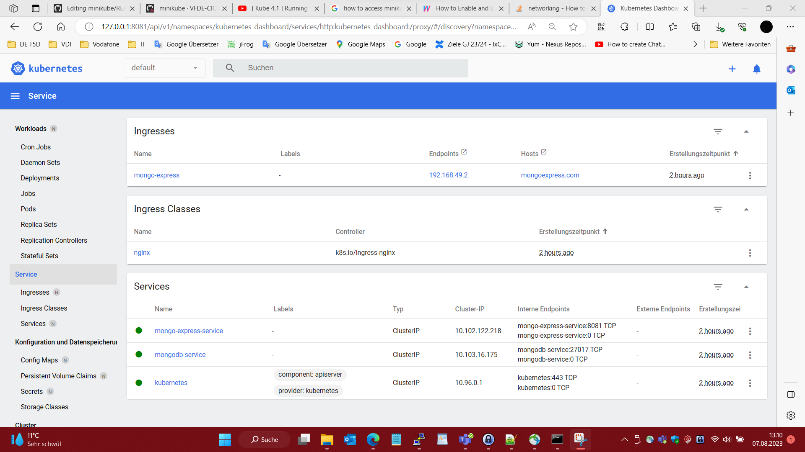
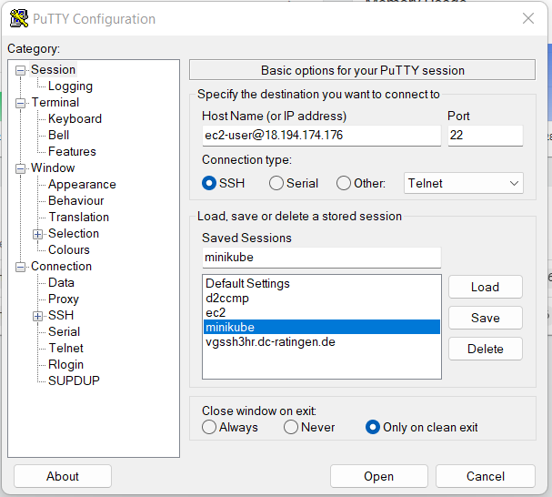
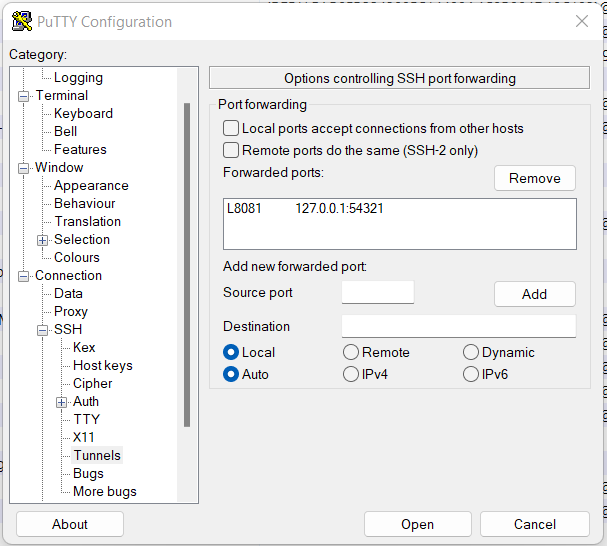

# mogo-express on minikube and ec2

minikube dashboard --url --port 54321 &

* Verifying dashboard health ...
* Launching proxy ...
* Verifying proxy health ...
http://127.0.0.1:54321/api/v1/namespaces/kubernetes-dashboard/services/http:kubernetes-dashboard:/proxy/

http://127.0.0.1:8081/api/v1/namespaces/kubernetes-dashboard/services/http:kubernetes-dashboard:/proxy/#/replicaset?namespace=default

# prerequisites
- on AWS Cloud create key pair. Public key automatically add to ec2:/home/ec2-user/.ssh/autorized_keys
- download your private key.pem
- edit key pair name in ec2.tf
this:
- secrets.PAT (need to clone this github repository with github actions workflow)
- secrets.PEM (private key - to connect ec2 with ssh)
## run
- runs automatic with this gihub actions workflow:
- https://github.vodafone.com/VFDE-CICDandCloud/bh67_ci_cd/actions/workflows/minikube.yml
### terraform.tf
https://github.vodafone.com/bernd-hohmann/minikube/blob/c7e3930b7158e711aa5a05164ce8bf26ad1d69e6/ec2.tf#L1-L75
